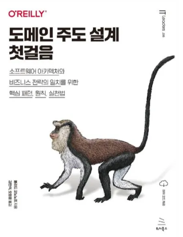
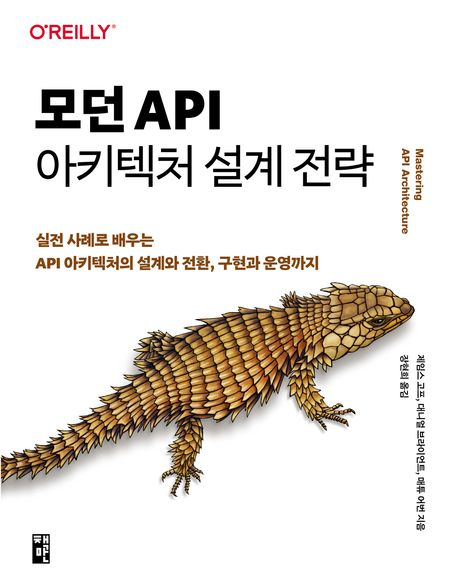

# DDD

# "도메인 주도 설계를 위한 함수형 프로그래밍”
[Chapter01. DDD 소개](https://moondongmin.notion.site/Chapter01-DDD-34e357c44e5680b9a309dd62b8b58949?source=copy_link)

[Chapter 2. 도메인 이해하기](https://moondongmin.notion.site/Chapter-2-34f357c44e568048adc7f0b14a6b8d55?source=copy_link)

[Chapter 03. 함수형 아키텍처](https://moondongmin.notion.site/Chapter-03-358357c44e5680c788c7de247a98deea?source=copy_link)

[Chapter 04. 타입 이해하기](https://moondongmin.notion.site/Chapter-04-358357c44e56802a8f7ec71721f081f7?source=copy_link)

# "도메인 주도 설계"

[Chapter 01. 지식 탐구](https://moondongmin.notion.site/Chapter-01-1e4357c44e5680bf95e9ed42e975114a?pvs=4)

[Chapter 02. 의사소통과 언어 사용](https://moondongmin.notion.site/Chapter-02-1e5357c44e5680f38695f5de9156f95f?pvs=4)

[Chapter 03. 모델과 구현의 연계](https://moondongmin.notion.site/Chapter-03-1ec357c44e5680029d31dc7c4d529005?pvs=4)

[Chapter 04. 도메인의 격리](https://moondongmin.notion.site/Chapter-04-1f3357c44e5680fc90b5c4636fa53167?pvs=4)

[Chapter 05. 소프트웨어에서 표현되는 모델](https://moondongmin.notion.site/Chapter-05-1f9357c44e5680fcb39bd49e3636441d?pvs=4)

[Chapter 06. 도메인 객체의 생명주기](https://moondongmin.notion.site/Chapter-06-214357c44e5680ea8b23c40f64245fec?source=copy_link)

[Chapter 07. 언어의 사용(확장 예제)](https://moondongmin.notion.site/Chapter-07-215357c44e5680af8002c030ebcab69e?source=copy_link)

[Chapter 08. 도약](https://moondongmin.notion.site/Chapter-08-21c357c44e5680f7b2c8f6f36e1eb642?source=copy_link)

[Chapter 09. 암시적인 개념을 명확하게](https://moondongmin.notion.site/Chapter-09-223357c44e56804e8c93df10a49dafe8?source=copy_link)

[Chapter 10. 유연한 설계](https://moondongmin.notion.site/Chapter-10-22b357c44e5680b3bc0aceb7794a0d30?source=copy_link)

[Chapter 11. 분석 패턴의 적용](https://moondongmin.notion.site/Chapter-11-23a357c44e5680e3869ae98795e42016?source=copy_link)

[Chapter 12. 모델과 디자인 패턴의 연결](https://moondongmin.notion.site/Chapter-12-240357c44e5680dfad22d41a5e0bc91a?source=copy_link)

[Chapter 13. 더 심층적인 통찰력을 향한 리팩터링](https://moondongmin.notion.site/Chapter-13-241357c44e5680bbbdc0c05a1e8c592c?source=copy_link)

[⭐️Chapter 14. 모델의 무결성 유지](https://moondongmin.notion.site/Chapter-14-247357c44e5680ed85bde8b5e0c6ba70?source=copy_link)

[Chapter 15. 디스틸레이션](https://moondongmin.notion.site/Chapter-15-25b357c44e568086bd26d5b8aa1bc464?source=copy_link)

[Chapter 16. 대규모 구조](https://moondongmin.notion.site/Chapter-16-264357c44e568036ac11f511239726f2?source=copy_link)

 

# "도메인 주도 설계 첫걸음"

## Part 1. 전략적 설계

[Chapter 01. 비즈니스 도메인 분석하기](https://moondongmin.notion.site/Chapter-01-1ac357c44e5680b88f01e09c074e66aa?pvs=4)

[Chapter 02. 도메인 지식 찾아내기](https://moondongmin.notion.site/Chapter-02-1ad357c44e56805d968fcf4325d411cd?pvs=4)

[Chapter 03. 도메인 복잡성 관리](https://moondongmin.notion.site/Chapter-03-1b4357c44e5680939346cfcdc3707123?pvs=4)

[Chapter 04. 바운디드 컨텍스트 연동](https://moondongmin.notion.site/Chapter-04-1b5357c44e5680a785f5d4a7cbc28ac8?pvs=4)

## Part 2. 전술적 설계

[Chapter 05. 간단한 비즈니스 로직 구현](https://moondongmin.notion.site/Chapter-05-1b5357c44e5680b3af13f23ad61b5c6e?pvs=4)

[Chapter 06. 복잡한 비즈니스 로직 다루기](https://moondongmin.notion.site/Chapter-06-1bb357c44e56809baf11eed788eeba3f?pvs=4)

[Chapter 07. 시간 차원의 모델링](https://moondongmin.notion.site/Chapter-07-1bb357c44e568099beb7caa40dd98f0a?pvs=4)

[Chapter 08. 아키텍처 패턴](https://moondongmin.notion.site/Chapter-08-1c1357c44e5680698aded127ff5e1976?pvs=4)

[Chapter 09. 커뮤니케이션 패턴](https://moondongmin.notion.site/Chapter-09-1c1357c44e568018a301c523aa7dd4fd?pvs=4)

## Part 3. 도메인 주도 설계 적용 실무

[Chapter 10. 휴리스틱 설계](https://moondongmin.notion.site/Chapter-10-1c8357c44e568089bff1e400d338d4da?pvs=4)

[Chapter 11. 진화하는 설계 의사결정](https://moondongmin.notion.site/Chapter-11-1c9357c44e568047a843d0f07cbd0359?pvs=4)

[Chapter 12. 이벤트스토밍](https://moondongmin.notion.site/Chapter-12-1d0357c44e56809ab310d1c5076f113c?pvs=4)

[Chapter 13. 실무에서의 도메인 주도 설계](https://moondongmin.notion.site/Chapter-13-1d0357c44e56808695f1ce555e09ff7f?pvs=4)

[Chapter 16. 데이터 메시](https://moondongmin.notion.site/Chapter-16-1d6357c44e5680eca10dd7043277a2e8?pvs=4)

 

# 모던 API 아키텍처 설계 전략

[0장. API 아키텍처 설계 여정을 시작하며](https://moondongmin.notion.site/0-API-30b357c44e56801f884bcce6eaad2511?source=copy_link)

## 1부 API 설계부터 구현, 테스트까지

[1장. API 설계, 구현, 명세](https://moondongmin.notion.site/1-API-30c357c44e5680d3bc8ce578f160e3cb?source=copy_link)

[2장. API 테스트](https://moondongmin.notion.site/2-API-318357c44e56807395ded0adea0c8fc2?source=copy_link)

## 2부 API 트래픽 관리

[3장. API 게이트웨이: 인그레스 트래픽 관리](https://moondongmin.notion.site/3-API-31f357c44e56809cbbbdcff9c90bf30e?source=copy_link)

[4장. 서비스 메시: 서비스 간 트래픽 관리](https://moondongmin.notion.site/4-323357c44e5680e48bb2cfcea0a9d09a?source=copy_link)

[5장. API의 배포와 릴리스](https://moondongmin.notion.site/5-API-32d357c44e5680f8a7ffc217657ad804?source=copy_link)

[6장. 운영 보안: API의 위협 모델](https://moondongmin.notion.site/6-API-335357c44e5680368431f544db1c28fd?source=copy_link)

[7장. API의 인증과 인가](https://moondongmin.notion.site/7-API-33b357c44e56804499d2facca04b9c64?source=copy_link)

[8장. API 주도 아키텍처로의 재설계](https://moondongmin.notion.site/8-API-33e357c44e5680fcbbded6aeafe31bb2?source=copy_link)

[9장. 클라우드 플랫폼으로의 진화](https://moondongmin.notion.site/9-347357c44e56800b8149c93fb1330fae?source=copy_link)

[10장. 지속적인 아키텍처 진화를 위해](https://moondongmin.notion.site/10-348357c44e56806ea69aca7334cd849d?source=copy_link)